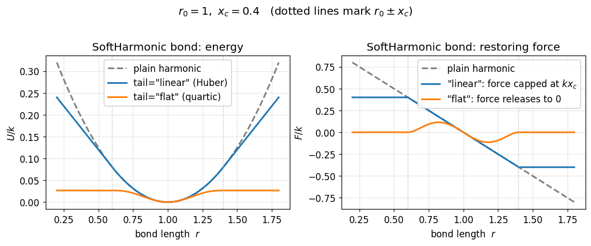
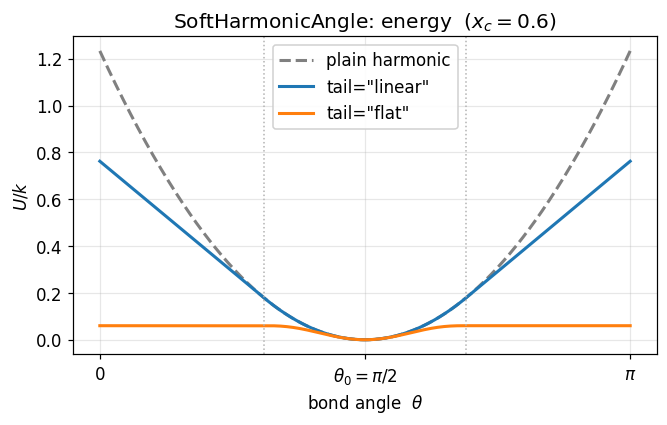
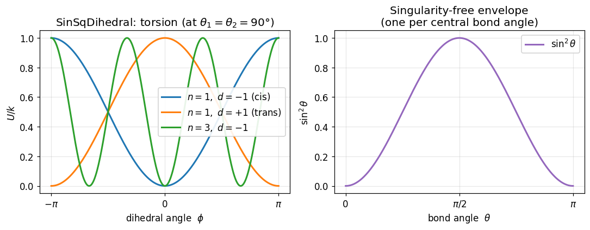
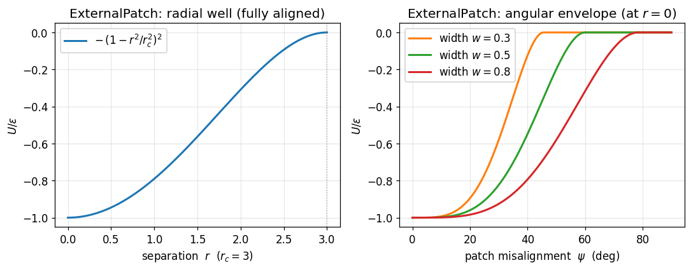
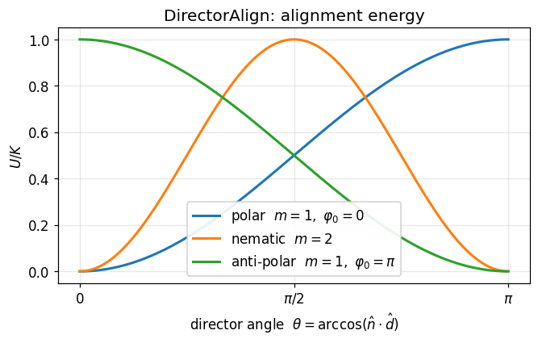
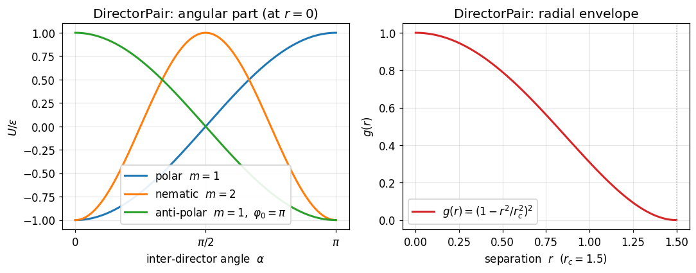

# hoomd-glab-plugins

**⚠️ This entire repository (code, tests, notebooks, and documentation) was
generated with the assistance of AI (GitHub Copilot). It may contain errors.
Please verify the formulas and implementation against your own understanding
before using in production.**

A [HOOMD-blue](https://hoomd-blue.readthedocs.io/) plugin providing seven custom
forces for bonded-interaction and anisotropic simulations, all running on **CPU
and GPU** (HIP/CUDA). Jump to a force:

**Bonded / topological — the everyday forces:**
- [**`SoftHarmonic`** — saturating / breakable harmonic bond](#softharmonic-bond)
- [**`SoftHarmonicAngle`** — saturating harmonic angle](#softharmonicangle-angle)
- [**`CosineAngle`** — worm-like-chain bending (bounded stiffness)](#cosineangle-worm-like-chain-bending)
- [**`SinSqDihedral`** — singularity-free dihedral](#sinsqdihedral-singularity-free-dihedral)

**Patchy self-assembly:**
- [**`ExternalPatch`** — directional patchy attraction (no quaternion DOFs)](#externalpatch-patchy-attraction)

**Orientation-coupled — require rotational degrees of freedom:**
- [**`DirectorAlign`** — align a body axis to two guide particles](#directoralign-angle-force)
- [**`DirectorPair`** — orientation-coupling pair potential (nematic / polar)](#directorpair-anisotropic-pair-potential)

---

## SoftHarmonic (bond)

### Physics

A harmonic bond that stays quadratic near the rest length but **saturates** in the
tail, so an over-stretched bond neither produces a runaway force nor stays
infinitely stiff. With signed deviation $x = r - r_0$ and crossover $x_c > 0$, both
tail modes share the same curvature at the minimum ($U''(0) = k$), so `k` keeps its
usual harmonic meaning and switching `tail` does not change the small-deformation
physics.

**`tail = "linear"`** (Huber / capped) — exactly harmonic inside $x_c$, then a
constant restoring force $k\,x_c$ (the bond never releases):

```math
U(x) = \begin{cases}
\tfrac{1}{2} k x^2 & |x| \le x_c \\
k x_c |x| - \tfrac{1}{2} k x_c^2 & |x| > x_c
\end{cases}
```

**`tail = "flat"`** (compact quartic damping) — the restoring force
$-k x (1 - (x/x_c)^2)^2$ decays smoothly to zero at $x_c$ and stays zero beyond it
(the bond softly releases); the energy plateaus at $k x_c^2 / 6$:

```math
U(x) = \begin{cases}
\tfrac{1}{2} k x^2 \left(1 - s^2 + \tfrac{1}{3} s^4\right),\ s = x/x_c & |x| \le x_c \\
\tfrac{1}{6} k x_c^2 & |x| > x_c
\end{cases}
```

The `"flat"` force is a single branch with no `exp`/`trig` — it is C¹ (force *and*
its slope vanish at $x_c$), cheaper than a Gaussian well and smoother than a cosine
ramp.



### Usage

```python
from hoomd import glab_forces

soft = glab_forces.SoftHarmonic()
soft.params["A-A"] = dict(k=100.0, r0=1.0, x_c=0.5, tail="linear")  # or "flat"

integrator = hoomd.md.Integrator(dt=0.005, methods=[...], forces=[soft])
```

### Parameters

| Parameter | Type | Default | Description |
|-----------|------|---------|-------------|
| `k` | float | — | Stiffness $[\mathrm{energy}\cdot\mathrm{length}^{-2}]$ |
| `r0` | float | — | Rest length $[\mathrm{length}]$ |
| `x_c` | float | — | Crossover deviation $[\mathrm{length}]$, must be $> 0$ |
| `tail` | str | `"linear"` | `"linear"` (constant-force cap) or `"flat"` (force releases to 0) |

---

## SoftHarmonicAngle (angle)

### Physics

The same saturating harmonic well applied to a bond **angle**: quadratic about the
equilibrium angle $t_0$, with a tail that either caps the restoring torque
(`"linear"`) or releases it to zero past a threshold (`"flat"` — a free hinge). The
piecewise energy is identical to `SoftHarmonic` ([above](#softharmonic-bond)) with $x = \theta - t_0$, again
sharing the curvature $U''(0) = k$.



### Usage

```python
import numpy
from hoomd import glab_forces

soft = glab_forces.SoftHarmonicAngle()
soft.params["A-A-A"] = dict(k=20.0, t0=numpy.pi, x_c=0.6, tail="flat")  # or "linear"

integrator = hoomd.md.Integrator(dt=0.005, methods=[...], forces=[soft])
```

### Parameters

| Parameter | Type | Default | Description |
|-----------|------|---------|-------------|
| `k` | float | — | Stiffness $[\mathrm{energy}\cdot\mathrm{radian}^{-2}]$ |
| `t0` | float | — | Equilibrium angle $[\mathrm{radian}]$ |
| `x_c` | float | — | Crossover deviation $[\mathrm{radian}]$, must be $> 0$ |
| `tail` | str | `"flat"` | `"flat"` (torque releases to 0) or `"linear"` (constant-torque cap) |

---

## CosineAngle (worm-like-chain bending)

### Physics

The standard worm-like-chain / "negative-cosine" bending potential,

```math
U(\theta) = k \left(1 - \cos(\theta - t_0)\right)
```

with preferred angle $t_0$ (default $\pi$ = straight, where it equals $k(1+\cos\theta)$). The
minimum is at $\theta = t_0$, the curvature there is $U''(t_0) = k$ (matching the harmonic
angle's stiffness in the small-deformation limit), and the energy is bounded in $[0, 2k]$. For
$t_0 = \pi$ the discrete-chain persistence length is $L_p \approx (k/k_BT)\,b$ in the stiff limit.

The Cartesian force prefactor is

```math
a = \frac{\mathrm{d}U}{\mathrm{d}(\cos\theta)} = -k\cos t_0 + k\sin t_0 \frac{\cos\theta}{\sin\theta},
```

whose singular $1/\sin\theta$ piece is **gated by $\sin t_0$**: for the worm-like-chain cases
$t_0 \in \{0, \pi\}$ it vanishes and $a = \mp k$ is *constant*. Note that the actual **force**
magnitude, $|a|\sin\theta/r$, is bounded for the harmonic angle too — the $1/\sin\theta$ is
cancelled by the geometry. What `CosineAngle` keeps bounded (and the harmonic angle does not) is
the **stiffness** (the Hessian / force constant, which diverges as $\sim 1/\theta$ toward a fold
and sets the stable timestep). A fold-prone chain therefore tolerates a **modestly** larger
timestep — but only when the chain actually samples folds and a weak thermostat lets the harmonic
angle's energy pumping show; a stiff (rarely-folding) or strongly-damped chain sees no difference
(see [`demo_cosine_angle`](docs/demo_cosine_angle.ipynb) for a near-NVE measurement). For an
arbitrary preferred angle $t_0 \notin \{0, \pi\}$ the collinear-endpoint stiffness is finite but no
longer singularity-free — use `hoomd.md.angle.CosineSquared` for an arbitrary-$t_0$
singularity-free form.

### Usage

```python
from hoomd import glab_forces

cosine = glab_forces.CosineAngle()
cosine.params["A-A-A"] = dict(k=5.0)              # t0 defaults to pi (straight)

integrator = hoomd.md.Integrator(dt=0.02, methods=[...], forces=[cosine])
```

### Parameters

| Parameter | Type | Default | Description |
|-----------|------|---------|-------------|
| `k` | float | — | Stiffness $[\mathrm{energy}\cdot\mathrm{radian}^{-2}]$ |
| `t0` | float | $\pi$ | Preferred angle $[\mathrm{radian}]$ |

---

## SinSqDihedral (singularity-free dihedral)

### Physics

The standard HOOMD `Periodic` dihedral potential
$U = \frac{k}{2}(1 + d\cos(n\phi - \phi_0))$
produces forces proportional to $1/\sin\theta$ where $\theta$ is the bond
angle at the central atoms of the dihedral quartet $(a,b,c,d)$. When three
consecutive atoms become collinear ($\theta \to 0$ or $\pi$), these forces
diverge, causing simulation instability.

`SinSqDihedral` eliminates this singularity by multiplying the potential with
$\sin^2\theta_1\,\sin^2\theta_2$:

$$U = \frac{k}{2}\bigl(1 + d\,\cos(n\phi - \phi_0)\bigr)\,\sin^2\!\theta_{abc}\;\sin^2\!\theta_{bcd}$$

where $\theta_{abc}$ and $\theta_{bcd}$ are the bond angles at the two central
atoms.

**Key properties:**

- When $\theta_1 = \theta_2 = 90°$, the $\sin^2$ factors are unity and the
  potential reduces to the standard periodic dihedral.
- As any three consecutive atoms become collinear ($\theta \to 0$ or $\pi$),
  both potential and forces smoothly go to zero — no divergence.
- All forces and virials are analytic and finite everywhere.

This is particularly important for **comb polymers**, **branched topologies**,
and any system where backbone bending allows near-collinear configurations.



### Usage

```python
import hoomd
from hoomd import glab_forces

sinsq = glab_forces.SinSqDihedral()
# d=-1 → minimum at φ=0 (cis); d=+1 → minimum at φ=π (trans)
sinsq.params["backbone"] = dict(k=5.0, d=-1, n=1, phi0=0)

integrator = hoomd.md.Integrator(dt=0.005, methods=[...], forces=[sinsq])
```

### Parameters

| Parameter | Type | Default | Description |
|-----------|------|---------|-------------|
| `k` | float | — | Spring constant $[\mathrm{energy}]$ |
| `d` | float | — | Sign factor ($+1$ or $-1$) |
| `n` | int | — | Multiplicity |
| `phi0` | float | 0.0 | Phase offset $\phi_0$ (radians) |

### Demo notebook

See [`docs/demo_sinsq_dihedral.ipynb`](docs/demo_sinsq_dihedral.ipynb) for:

1. **Force landscape** — 2-D heatmaps comparing force magnitudes of
   `SinSqDihedral` (bounded) vs. `Periodic` (divergent) across all bond-angle
   combinations.
2. **Backbone helix** — a 2000-bead near-collinear chain ($\theta_0 = 170°$)
   folds into a gauche helix while the dihedral force stays finite.
3. **Stability comparison** — `SinSqDihedral` integrates stably at ~2× the time
   step of `Periodic` on the same near-collinear chain.

---

## ExternalPatch (patchy attraction)

### Physics

A patchy attraction between designated particles, with patch directions defined
**externally** by partner particles rather than by quaternion degrees of freedom.
Each patched particle $i$ carries a virtual patch pointing toward its partner $j$;
when two patched particles come within $r_c$, they attract via

$$U_{ik} = -\varepsilon\,(1 - r^2/r_c^2)^2\, f_i\, f_k$$

where $f_i$ is a cubic Hermite (smoothstep) angular envelope of the alignment
$u = \hat{p}_i \cdot \hat{r}_{ik}$ between patch $i$ and the separation direction:

$$t = \mathrm{clamp}\!\left(\frac{u - (1 - w)}{w},\, 0,\, 1\right), \qquad f = 3t^2 - 2t^3$$

The patch is fully active ($f = 1$) when aligned ($u \ge 1$) and inactive ($f = 0$)
once misaligned beyond the `width` $w$ ($u \le 1 - w$). The radial factor
$(1 - r^2/r_c^2)^2$ sends both energy and force smoothly to zero at $r_c$. The
"torque" on a patch manifests as non-central translational forces on the partner
particles — no rotational DOFs are required.



### Usage

```python
from hoomd import glab_forces

nlist = hoomd.md.nlist.Cell(buffer=0.4)
patch = glab_forces.ExternalPatch(nlist=nlist, r_cut=3.0)
patch.epsilon = 5.0
patch.width = 0.5
patch.partners = [(0, 1), (2, 3)]   # (attractor_tag, director_tag) pairs
sim.operations.integrator.forces.append(patch)
```

### Parameters

| Parameter | Type | Default | Description |
|-----------|------|---------|-------------|
| `epsilon` | float | — | Attraction strength $\varepsilon$ |
| `width` | float | 0.5 | Hermite transition width $w$ in cosine space |
| `r_cut` | float | — | Cutoff radius $r_c$ (constructor argument) |
| `partners` | list[(int,int)] | `[]` | `(attractor_tag, director_tag)` pairs defining patch directions |

---

## DirectorAlign (angle force)

### Physics

For an angle group `(i, j, k)`:
- Particle `i` is the **oriented** particle whose body-frame x-axis `n̂ = rotate(q_i, x̂)`
  should align with the target direction.
- Particles `j` and `k` are **guide** particles that define the target direction
  `d̂ = (r_k − r_j) / |r_k − r_j|`.

The potential energy is:

$$U = \frac{K}{2}\bigl(1 - \cos(m \theta + \varphi_0)\bigr), \quad \theta = \arccos(\hat{n} \cdot \hat{d})$$

where $m$ is `multiplicity` (default 1) and $\varphi_0$ is `phase` (default 0).
With the defaults this reduces to $U = \frac{K}{2}(1 - \hat{n}\cdot\hat{d})$.



### Usage

```python
import hoomd
from hoomd import glab_forces

align_force = glab_forces.DirectorAlign()
align_force.params["align"] = dict(k=20.0)  # polar (default)

# Nematic (head-tail symmetric) alignment:
align_force.params["align"] = dict(k=20.0, multiplicity=2)

integrator = hoomd.md.Integrator(dt=0.005, methods=[...], forces=[align_force])
integrator.integrate_rotational_dof = True  # required!
```

---

## DirectorPair (anisotropic pair potential)

### Physics

An orientation-dependent pair potential between particles within a cutoff
distance $r_c$:

$$U_{ij} = -\varepsilon \cos(m \alpha + \varphi_0) g(r)$$

with the smooth compact envelope

$$g(r) = \left(1 - \frac{r^2}{r_c^2}\right)^2$$

where $\alpha = \arccos(\hat{n}_i \cdot \hat{n}_j)$ is the angle between the
particle directors, $\hat{n} = \mathrm{rotate}(q, \hat{x})$ is each particle's
body-frame x-axis rotated into the lab frame, $m$ is `multiplicity` (default 1),
and $\varphi_0$ is `phase` (default 0).

| `multiplicity` | Symmetry | Minimum energy configuration |
|----------------|----------|------------------------------|
| 1 (default) | **Polar** | parallel only ($\alpha = 0$) |
| 2 | **Nematic** | parallel *or* anti-parallel ($\alpha = 0$ or $\pi$) |

The smooth compact envelope $g(r) = (1 - r^2/r_c^2)^2$ ensures both force and
energy vanish continuously at the cutoff.



### Usage

```python
from hoomd import glab_forces

nlist = hoomd.md.nlist.Cell(buffer=0.4)

# Polar coupling (default, multiplicity=1):
polar = glab_forces.DirectorPair(nlist=nlist, default_r_cut=1.5)
polar.params[("A", "A")] = dict(epsilon=4.0)

# Nematic coupling (multiplicity=2):
nematic = glab_forces.DirectorPair(nlist=nlist, default_r_cut=1.5)
nematic.params[("A", "A")] = dict(epsilon=4.0, multiplicity=2)

integrator = hoomd.md.Integrator(dt=0.005, methods=[...], forces=[nematic])
integrator.integrate_rotational_dof = True  # required!
```

### Parameters

| Parameter | Type | Default | Description |
|-----------|------|---------|-------------|
| `epsilon` | float | — | Coupling strength $\varepsilon$ |
| `multiplicity` | int | 1 | Angular multiplicity $m$ (1 = polar, 2 = nematic) |
| `phase` | float | 0 | Phase offset $\varphi_0$ in radians |

---

## Examples

Example notebooks live in [`docs/`](docs/), one per force, each a single clean
pipeline (configure → forces → Langevin → visualize) that shows the force's
*emergent* behaviour on a real GPU simulation:

| notebook | force(s) | shows |
|----------|----------|-------|
| [`demo_soft_harmonic`](docs/demo_soft_harmonic.ipynb) | `SoftHarmonic` + `SoftHarmonicAngle` | thermal kinks, brittle-vs-ductile rupture, larger stable `dt` |
| [`demo_cosine_angle`](docs/demo_cosine_angle.ipynb) | `CosineAngle` | worm-like-chain persistence length; force/stiffness landscape; near-NVE kinetic-energy drift vs timestep |
| [`demo_sinsq_dihedral`](docs/demo_sinsq_dihedral.ipynb) | `SinSqDihedral` | bounded forces near collinear; a helix; larger stable `dt` |
| [`demo_external_patch`](docs/demo_external_patch.ipynb) | `ExternalPatch` | patchy self-assembly into dimers and filaments |
| [`demo_align_angle`](docs/demo_align_angle.ipynb) | `DirectorAlign` | orientations order onto a polymer's local tangent |
| [`demo_director_pair`](docs/demo_director_pair.ipynb) | `DirectorPair` | spontaneous nematic vs polar ordering |

The shared plotting/analysis helpers live in [`docs/demo_viz.py`](docs/demo_viz.py)
(the simulation half of each notebook is self-contained and imports nothing from it).
The analytic energy-landscape figures above are produced by
[`docs/energy_landscapes.ipynb`](docs/energy_landscapes.ipynb) (numpy only, no HOOMD
run required), which also (re)writes the PNGs in `docs/figures/`. Performance
benchmarks live under [`benchmarks/`](benchmarks/).

---

## Building

Compatible with both **upstream HOOMD-blue** (glotzerlab) and the
**[hoomd-sloptimize](https://github.com/glab-vbc/hoomd-sloptimize)** mixed-precision fork.
Requires GPU support (HIP/CUDA).

```bash
# Point CMAKE_PREFIX_PATH at the HOOMD install prefix
# (the directory containing lib/python3.X/site-packages/hoomd/)
cmake -B build -S . -DCMAKE_PREFIX_PATH=/path/to/hoomd-install
cmake --build build -j$(nproc)
cmake --install build
```

When building against hoomd-sloptimize, forces are automatically evaluated in
`ForceReal` (float32) precision. Against upstream HOOMD, `ForceReal` is aliased
to `Scalar` via the `MixedPrecisionCompat.h` shim, so no source changes are
needed. The build also **auto-detects** installs that ship a native `ForceReal`
type *without* defining the `HOOMD_HAS_FORCEREAL` guard macro (some upstream 6.x
builds): `src/CMakeLists.txt` probes the installed `hoomd/HOOMDMath.h` at configure
time and defines the macro itself, so you never need to pass `-DHOOMD_HAS_FORCEREAL`
manually.

## Tests

```bash
python -m pytest src/pytest/
```

One test module per force (`test_align_angle`, `test_nematic_pair`,
`test_sinsq_dihedral`, `test_soft_harmonic_bond`, `test_soft_harmonic_angle`,
`test_external_patch`), validating energies and forces against analytic and
finite-difference references on both CPU and GPU.

---

## Mathematical and Physical Details

This section provides the full derivations behind the orientation-coupling forces,
from physical motivation to implementation-level detail. (The bonded saturating
forces and the patch force are documented in their sections above.)

### Motivation

Many soft-matter and biophysical systems involve **anisotropic particles** —
objects whose interactions depend not only on inter-particle distance but also on
orientation. Examples include:

- **Polymer segments** whose backbone tangent defines a preferred axis,
- **Liquid-crystal mesogens** that tend to align with their neighbours,
- **Elongated colloids** with direction-dependent attraction.

In coarse-grained models, each particle carries a **quaternion** $q$ that
describes its orientation. The **director** is a unit vector obtained by rotating
a reference body-frame axis into the lab frame:

$$\hat{n} = \mathrm{rotate}(q, \hat{x})$$

where $\hat{x} = (1,0,0)$ is the body-frame x-axis.

This plugin provides six forces:

| Force | Topology | Purpose |
|-------|----------|---------|
| `DirectorAlign` | Angle $(i,j,k)$ | Steer particle $i$'s director toward an externally defined direction |
| `DirectorPair` | Pair $(i,j)$ | Couple neighbouring particle directors to each other |
| `SinSqDihedral` | Dihedral $(a,b,c,d)$ | Singularity-free dihedral that vanishes at collinear geometries |
| `SoftHarmonic` | Bond $(i,j)$ | Harmonic bond with a capped (`linear`) or releasing (`flat`) tail |
| `SoftHarmonicAngle` | Angle $(i,j,k)$ | Harmonic angle with a capped or releasing tail |
| `ExternalPatch` | Neighbour list | Patchy attraction with externally defined patch directions |

Both potentials share the same `(multiplicity, phase)` parametrization of their
angular dependence, described next.

---

### The Generalised Angular Factor

Both forces use a potential of the form

$$f(\alpha) = \cos(m \alpha + \varphi_0)$$

where $\alpha$ is a geometric angle (between a director and a target direction,
or between two directors), $m \in \{1,2,3,\dots\}$ is the **multiplicity**, and
$\varphi_0$ is a **phase offset** in radians.

Useful special cases:

| $m$ | $\varphi_0$ | $f(\alpha)$ | Behaviour |
|-----|-------------|-------------|-----------|
| 1 | 0 | $\cos\alpha$ | **Polar**: minimum at $\alpha = 0$, maximum at $\alpha = \pi$ |
| 2 | 0 | $\cos 2\alpha$ | **Nematic**: minima at $\alpha = 0$ and $\pi$, maximum at $\pi/2$ |
| 1 | $\pi$ | $-\cos\alpha$ | **Anti-polar**: minimum at $\alpha = \pi$ |
| 2 | $\pi/2$ | $-\sin 2\alpha$ | Tilted equilibrium at $\alpha = \pi/4$ |

The derivative that enters torques and forces is

$$\frac{d f}{d \alpha} = -m \sin(m \alpha + \varphi_0).$$

---

### DirectorAlign — Full Derivation

#### Setup

An **angle group** $(i, j, k)$ defines two geometric objects:

1. The **director** of particle $i$: $\hat{n} = \mathrm{rotate}(q_i, \hat{x})$.
2. The **target direction** from guide particle $j$ to guide particle $k$:

$$\mathbf{d} = \mathbf{r}_k - \mathbf{r}_j, \qquad
\hat{d} = \frac{\mathbf{d}}{\lvert\mathbf{d}\rvert}.$$

(Minimum-image convention is applied to $\mathbf{d}$ for periodic boundaries.)

The angle between them is

$$\theta = \arccos(\hat{n} \cdot \hat{d}), \qquad \theta \in [0, \pi].$$

#### Potential energy

$$U = \frac{K}{2}\bigl(1 - \cos(m \theta + \varphi_0)\bigr)$$

This vanishes at the minimum ($m \theta + \varphi_0 = 0 \bmod 2\pi$)
and reaches $K$ at the maximum.

#### Torque on particle $i$

The potential depends on $i$'s orientation through $\hat{n}(\theta)$.
The orientational gradient gives a torque (in the lab frame):

$$\boldsymbol{\tau}_i
= -\frac{\partial U}{\partial \hat{n}} \times \hat{n}
= \frac{K}{2} F_\theta \; \hat{n} \times \hat{d}$$

where $F_\theta = m \sin(m\theta + \varphi_0) / \sin\theta$ generalises
the simple $m{=}1$ result. When
$\sin\theta \to 0$ (parallel or anti-parallel), the cross product
$\hat{n} \times \hat{d}$ also vanishes, keeping the product finite;
numerically we set $F_\theta = 0$ when $\sin\theta < 10^{-8}$.

#### Forces on guide particles $j$ and $k$

The potential also depends on the direction $\hat{d}$, which is a function of
$\mathbf{r}_j$ and $\mathbf{r}_k$. Differentiating with respect to
$\mathbf{r}_j$ (with $\hat{d}$ depending on $\mathbf{r}_k - \mathbf{r}_j$):

$$\mathbf{F}_j
= -\frac{\partial U}{\partial \mathbf{r}_j}
= -\frac{K}{2} \frac{F_\theta}{\lvert\mathbf{d}\rvert}
 \bigl(\hat{n} - \cos\theta \hat{d}\bigr).$$

Newton's third law for the guide pair gives

$$\mathbf{F}_k = -\mathbf{F}_j.$$

**No translational force acts on particle $i$**, because $U$ depends on $i$
only through its orientation $q_i$.

#### Virial

The virial contribution is

$$W_{ab} = \frac{1}{3} F_j^{(a)} d^{(b)}$$

(the factor $\frac{1}{3}$ distributes the virial equally among the three
particles in the angle group, following HOOMD-blue convention).

---

### DirectorPair — Full Derivation

#### Setup

For a pair of anisotropic particles $i$ and $j$ separated by
$\mathbf{r} = \mathbf{r}_i - \mathbf{r}_j$ with $r = \lvert\mathbf{r}\rvert < r_c$,
define:

- **Directors**: $\hat{n}_i = \mathrm{rotate}(q_i, \hat{x})$, $\hat{n}_j = \mathrm{rotate}(q_j, \hat{x})$.
- **Inter-director angle**: $\alpha = \arccos(\hat{n}_i \cdot \hat{n}_j)$, $\alpha \in [0, \pi]$.
- **Radial envelope**: $g(r) = \bigl(1 - r^2/r_c^2\bigr)^2$.

The envelope $g(r)$ is a smooth, compactly-supported function that satisfies:

$$g(0) = 1, \qquad g(r_c) = 0, \qquad g'(r_c) = 0,$$

ensuring that both the energy and forces vanish continuously at the cutoff.
Explicitly, writing $x \equiv 1 - r^2/r_c^2$:

$$g = x^2, \qquad
\frac{dg}{dr} = -\frac{4 x r}{r_c^2}.$$

#### Potential energy

$$U = -\varepsilon \cos(m \alpha + \varphi_0) \; g(r)$$

The factors separate into an angular part (coupling strength × angular
preference) and a radial part (distance modulation with smooth cutoff).

#### Radial force

The radial contribution to the force on particle $i$ comes from differentiating
$g(r)$ with respect to $\mathbf{r}$:

$$\mathbf{F}_i^{(\mathrm{radial})}
= -\frac{\partial U}{\partial \mathbf{r}}
= -\varepsilon \cos(m\alpha + \varphi_0) \frac{dg}{d\mathbf{r}}
= \frac{4\varepsilon \cos(m\alpha+\varphi_0) x}{r_c^2} \mathbf{r}$$

where $\mathbf{r} = \mathbf{r}_i - \mathbf{r}_j$ and $x = 1 - r^2/r_c^2$.
When the angular factor is positive, the force coefficient in the code,

$$f_{\mathrm{mag}} = -\frac{4\varepsilon \cos(m\alpha+\varphi_0) \, x}{r_c^2}$$

is negative, so the force points antiparallel to $\mathbf{r}$,
i.e. **toward** particle $j$ — attractive, as expected.

Newton's third law: $\mathbf{F}_j^{(\mathrm{radial})} = -\mathbf{F}_i^{(\mathrm{radial})}$.

#### Orientational torques

The angular part of $U$ depends on $\hat{n}_i$ and $\hat{n}_j$. Differentiating
with respect to the orientations:

$$\boldsymbol{\tau}_i
= \varepsilon T_\alpha \; g(r) \; \hat{n}_i \times \hat{n}_j$$

where $T_\alpha = m \sin(m\alpha + \varphi_0) / \sin\alpha$.

**Derivation sketch.** The chain rule gives

$$\frac{\partial U}{\partial \hat{n}_i}
= -\varepsilon g \frac{\partial}{\partial \hat{n}_i}\cos(m\alpha+\varphi_0)
= \varepsilon g m\sin(m\alpha+\varphi_0) \frac{\partial \alpha}{\partial \hat{n}_i}.$$

Since $\cos\alpha = \hat{n}_i \cdot \hat{n}_j$, we have
$\frac{\partial \alpha}{\partial \hat{n}_i} = -\hat{n}_j / \sin\alpha$ (projected
onto the plane perpendicular to $\hat{n}_i$). The cross product with $\hat{n}_i$
then yields $\hat{n}_i \times \hat{n}_j / \sin\alpha$.

The torque on $j$ follows by the equal-and-opposite principle for a pair that
depends on the angle between the directors:

$$\boldsymbol{\tau}_j = -\boldsymbol{\tau}_i.$$

#### Singularity at $\sin\alpha = 0$

When $\alpha \to 0$ or $\alpha \to \pi$ (parallel or anti-parallel directors),
$\sin\alpha \to 0$ and the ratio $\sin(m\alpha+\varphi_0)/\sin\alpha$ is
formally $0/0$.

Physically, the torque must vanish at these configurations because
the cross product

$$\hat{n}_i \times \hat{n}_j \to \mathbf{0}$$

The product

$$T_\alpha \cdot (\hat{n}_i \times \hat{n}_j)$$

remains finite by L'Hôpital's rule:

$$\lim_{\alpha\to 0} \frac{\sin(m\alpha)}{\sin\alpha} = m$$

multiplied by $\sin\alpha \to 0$ from the cross product norm.

In the implementation, we set $T_\alpha = 0$ whenever $\sin\alpha < 10^{-8}$.

---

### Relationship to $\cos^p$ Formulations

Earlier versions of the code parameterised the nematic pair potential using an
integer power $p$:

$$U_{\mathrm{old}} = -\varepsilon (\hat{n}_i \cdot \hat{n}_j)^p g(r).$$

The `multiplicity` formulation generalises this. The two are related but **not
identical** for $p = m$:

| Old (`power`) | New (`multiplicity`) | Relationship |
|---------------|----------------------|--------------|
| $p = 1$ | $m = 1, \varphi_0 = 0$ | **Identical**: $\cos\alpha = \cos\alpha$ |
| $p = 2$ | $m = 2, \varphi_0 = 0$ | $\cos^2\alpha = \tfrac{1}{2}(1 + \cos 2\alpha)$, so $U_{\mathrm{new}} = 2 U_{\mathrm{old}} + \varepsilon g$ |

For $m = 2$: the equilibria (minima, maxima, saddle points) are the same, but the
energy scale differs by a factor of 2. To recover identical dynamics, **halve
$\varepsilon$** compared to the old $p = 2$ parametrization.

The `multiplicity + phase` form is strictly more general because it can produce
angular dependencies (e.g. $\cos 3\alpha$, or $\sin 2\alpha$ via phase $= \pi/2$)
that no single integer power of $\cos\alpha$ can represent.

---

### Summary of All Equations

#### DirectorAlign

| Quantity | Expression |
|----------|------------|
| Energy | $U = \frac{K}{2}(1 - \cos(m\theta + \varphi_0))$ |
| Torque on $i$ | $\boldsymbol{\tau}_i = \frac{K}{2} \frac{m\sin(m\theta+\varphi_0)}{\sin\theta} \hat{n}\times\hat{d}$ |
| Force on $j$ | $\mathbf{F}_j = -\frac{K}{2} \frac{m\sin(m\theta+\varphi_0)}{\sin\theta \cdot \lvert\mathbf{d}\rvert} (\hat{n} - \cos\theta \hat{d})$ |
| Force on $k$ | $\mathbf{F}_k = -\mathbf{F}_j$ |
| Force on $i$ | $\mathbf{F}_i = \mathbf{0}$ |

where $\theta = \arccos(\hat{n}\cdot\hat{d})$, $\hat{n} = \mathrm{rotate}(q_i, \hat{x})$, $\hat{d} = (\mathbf{r}_k - \mathbf{r}_j)/\lvert\mathbf{r}_k - \mathbf{r}_j\rvert$.

#### DirectorPair

| Quantity | Expression |
|----------|------------|
| Energy | $U = -\varepsilon \cos(m\alpha+\varphi_0) g(r)$ |
| Envelope | $g(r) = (1 - r^2/r_c^2)^2$ |
| Radial force on $i$ | $\mathbf{F}_i = -\frac{4\varepsilon \cos(m\alpha+\varphi_0) (1-r^2/r_c^2)}{r_c^2} \mathbf{r}$ |
| Torque on $i$ | $\boldsymbol{\tau}_i = \varepsilon \frac{m\sin(m\alpha+\varphi_0)}{\sin\alpha} g(r) \hat{n}_i \times \hat{n}_j$ |
| Torque on $j$ | $\boldsymbol{\tau}_j = -\boldsymbol{\tau}_i$ |
| Force on $j$ | $\mathbf{F}_j = -\mathbf{F}_i$ |

where $\alpha = \arccos(\hat{n}_i \cdot \hat{n}_j)$, $\mathbf{r} = \mathbf{r}_i - \mathbf{r}_j$.

#### SinSqDihedral

| Quantity | Expression |
|----------|------------|
| Energy | $U = \frac{k}{2}(1 + d\cos(n\phi - \phi_0))\sin^2\theta_1\sin^2\theta_2$ |
| Force on atom $a$ | Analytic; proportional to $\sin\theta_1\sin^2\theta_2$ (bounded) |
| Force on atom $d$ | Analytic; proportional to $\sin^2\theta_1\sin\theta_2$ (bounded) |
| Forces on atoms $b,c$ | Analytic; include both torsional and bond-angle coupling terms |

where $\phi$ is the dihedral angle of quartet $(a,b,c,d)$,
$\theta_1 = \theta_{abc}$ is the bond angle at $b$, and
$\theta_2 = \theta_{bcd}$ is the bond angle at $c$.

All forces remain finite everywhere. When $\theta_1 \to 0$ or $\pi$
(atoms $a,b,c$ collinear), the $\sin^2\theta_1$ prefactor sends $U \to 0$
and the $1/\sin\theta_1$ from the dihedral-angle derivative is cancelled
by the $\sin\theta_1$ from the product rule, leaving a bounded result.
The same applies for $\theta_2$.

---

## License

BSD 3-Clause License. See [LICENSE](LICENSE) for details.
